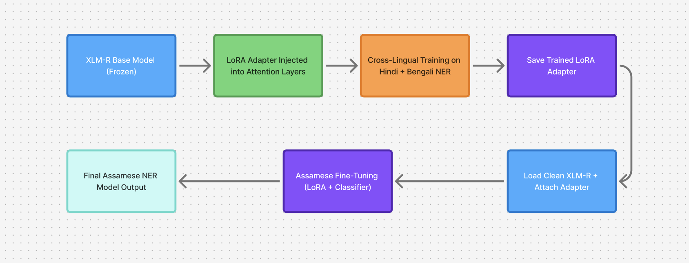

# 🌟 LoRA-Powered Cross-Lingual NER for Assamese  
### *Low-Resource Named Entity Recognition using Hindi–Bengali Transfer Learning + LoRA Adapters*

---

## 🚀 Overview

This project implements a **parameter-efficient, cross-lingual transfer learning pipeline** for **Assamese Named Entity Recognition (NER)** using **XLM-RoBERTa** and **LoRA adapters**.

Instead of fully fine-tuning a large multilingual model, we:

1. Train LoRA adapters on **Hindi + Bengali NER datasets**  
2. Inject cross-lingual knowledge into the adapter  
3. Attach the trained adapter to a clean XLM-R model  
4. Fine-tune *only the adapter* on **Assamese NER**  

📈 **Performance Gain:**  
- Baseline XLM-R F1: **0.13**  
- LoRA + Cross-Lingual Transfer F1: **0.72+**  

This is a ~7× improvement on a low-resource language.

---



## 🎯 Key Features

- ⚡ **Parameter-Efficient Fine-Tuning (LoRA)**
- 🌍 **Cross-lingual NER transfer from Hindi + Bengali**
- ✨ **Works with extremely small Assamese datasets**
- 🧠 **Subword token–label alignment for accuracy**
- 💾 **Only adapter weights saved (very lightweight)**
- 🚀 **Fast training (15–20 minutes on Kaggle T4)**

---

## 📚 Motivation

Assamese is a **low-resource Indic language** with limited labeled NER data.  
Multilingual models like XLM-R struggle when fine-tuned directly due to:

- limited Assamese vocabulary coverage  
- tokenizer fragmentation  
- small dataset size  

However, Assamese shares:

- script similarity with **Bengali**  
- semantic/entity patterns with **Hindi**

We exploit this using **cross-lingual alignment** + **LoRA**.

---

## 📦 Dataset Sources

| Language | Dataset | Purpose |
|---------|----------|----------|
| Assamese | WikiANN (as) | Final fine-tuning |
| Hindi | WikiANN (hi) | Cross-lingual alignment |
| Bengali | WikiANN (bn) | Cross-lingual alignment |

---

## 🛠️ Technologies Used

- **Python 3.10**
- **HuggingFace Transformers**
- **PEFT (LoRA)**
- **Datasets Library**
- **SeqEval**
- **Accelerate**

---

## 🔧 Installation

```bash
pip install transformers==4.44.0
pip install peft==0.12.0
pip install datasets seqeval accelerate sentencepiece


